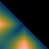
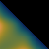
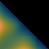
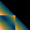
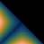
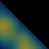
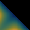
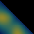

|minimum|maximum|average|map name|delta image|
|0.0405|1.4119|0.6884|vik_range_tritanomaly||
|0.0356|1.3736|0.6641|vik_range_normal||
|0.0401|1.1924|0.6188|roma_range_tritanomaly||
|0.0308|1.4255|0.6139|vik_range_deuteranomaly||
|0.0372|1.4254|0.6126|oleron_range_normal||
|0.0235|1.7245|0.6112|oslo_range_tritanomaly||
|0.0219|1.5498|0.6105|batlowW_range_tritanomaly||
|0.0272|1.7254|0.6071|oslo_range_normal||
|0.0229|1.4947|0.6062|vik_range_protanomaly||
|0.0198|1.4883|0.6011|lisbon_range_normal||
|0.0332|1.3611|0.6006|oleron_range_deuteranomaly||
|0.0144|1.4289|0.6006|bam_range_protanomaly||
|0.0247|1.2790|0.6001|berlin_range_normal||
|0.0300|1.2569|0.5999|berlin_range_tritanomaly||
|0.0264|1.7249|0.5991|oslo_range_deuteranomaly||
|0.0120|1.4651|0.5977|bam_range_normal||
|0.0248|1.3442|0.5977|oleron_range_protanomaly||
|0.0189|1.4847|0.5967|lisbon_range_deuteranomaly||
|0.0372|1.4173|0.5964|bukavu_range_normal||
|0.0353|1.1697|0.5958|roma_range_normal||
|0.0196|1.5368|0.5955|lisbon_range_tritanomaly||
|0.0192|1.4877|0.5922|batlowW_range_normal||
|0.0175|1.4696|0.5911|lisbon_range_protanomaly||
|0.0233|1.7248|0.5909|oslo_range_protanomaly||
|0.0153|1.6351|0.5904|davos_range_tritanomaly||
|0.0148|1.6165|0.5883|naviaW_range_tritanomaly||
|0.0193|1.4203|0.5865|tofino_range_protanomaly||
|0.0209|1.5201|0.5857|lajolla_range_tritanomaly||
|0.0115|1.3907|0.5852|vanimo_range_protanomaly||
|0.0105|1.4739|0.5835|vanimo_range_normal||
|0.0312|1.3198|0.5831|roma_range_protanomaly||
|0.0205|1.3511|0.5803|bukavu_range_tritanomaly||
|0.0264|1.4787|0.5782|devon_range_tritanomaly||
|0.0172|1.4213|0.5759|tofino_range_deuteranomaly||
|0.0290|1.4231|0.5758|broc_range_deuteranomaly||
|0.0287|1.4361|0.5741|broc_range_normal||
|0.0268|1.4330|0.5741|broc_range_protanomaly||
|0.0356|1.2029|0.5735|roma_range_deuteranomaly||
|0.0287|1.5553|0.5728|lipari_range_tritanomaly||
|0.0226|1.6162|0.5711|turku_range_tritanomaly||
|0.0159|1.4532|0.5706|tofino_range_normal||
|0.0082|1.3654|0.5701|bam_range_tritanomaly||
|0.0208|1.3802|0.5683|batlow_range_tritanomaly||
|0.0113|1.3681|0.5672|bam_range_deuteranomaly||
|0.0215|1.5569|0.5654|batlowK_range_normal||
|0.0199|1.3223|0.5647|hawaii_range_protanomaly||
|0.0264|1.6199|0.5646|turku_range_normal||
|0.0198|1.3582|0.5643|batlow_range_normal||
|0.0198|1.5094|0.5637|batlowK_range_tritanomaly||
|0.0166|1.4585|0.5619|cork_range_normal||
|0.0091|1.4079|0.5618|vanimo_range_deuteranomaly||
|0.0175|1.3794|0.5613|broc_range_tritanomaly||
|0.0338|1.3340|0.5602|bukavu_range_deuteranomaly||
|0.0194|1.4248|0.5597|cork_range_protanomaly||
|0.0183|1.4253|0.5561|cork_range_deuteranomaly||
|0.0201|1.5818|0.5559|naviaW_range_deuteranomaly||
|0.0423|1.4466|0.5553|oleron_range_tritanomaly||
|0.0231|1.4094|0.5545|devon_range_normal||
|0.0177|1.5852|0.5539|naviaW_range_normal||
|0.0255|1.7321|0.5533|grayC_range_protanomaly||
|0.0255|1.7321|0.5533|grayC_range_normal||
|0.0255|1.7321|0.5533|grayC_range_tritanomaly||
|0.0255|1.7321|0.5533|grayC_range_deuteranomaly||
|0.0069|1.3957|0.5521|vanimo_range_tritanomaly||
|0.0238|1.5644|0.5513|davos_range_deuteranomaly||
|0.0190|1.3174|0.5510|glasgow_range_protanomaly||
|0.0245|1.3116|0.5506|bukavu_range_protanomaly||
|0.0222|1.4969|0.5485|batlowW_range_deuteranomaly||
|0.0196|1.5580|0.5476|fes_range_normal||
|0.0256|1.5009|0.5455|lapaz_range_tritanomaly||
|0.0203|1.4998|0.5452|lajolla_range_normal||
|0.0060|1.0204|0.5452|vikO_range_tritanomaly||
|0.0249|1.4499|0.5438|devon_range_deuteranomaly||
|0.0232|1.5653|0.5415|davos_range_normal||
|0.0191|1.5976|0.5410|turku_range_deuteranomaly||
|0.0198|1.5606|0.5368|naviaW_range_protanomaly||
|0.0170|1.5500|0.5368|navia_range_tritanomaly||
|0.0169|1.2664|0.5366|berlin_range_deuteranomaly||
|0.0109|1.3132|0.5348|berlin_range_protanomaly||
|0.0241|1.5327|0.5346|fes_range_tritanomaly||
|0.0161|1.4852|0.5314|lajolla_range_deuteranomaly||
|0.0249|1.4492|0.5296|devon_range_protanomaly||
|0.0219|1.5436|0.5294|davos_range_protanomaly||
|0.0091|1.5508|0.5293|fes_range_deuteranomaly||
|0.0292|1.0898|0.5292|managua_range_tritanomaly||
|0.0044|1.5561|0.5241|fes_range_protanomaly||
|0.0093|1.4050|0.5228|cork_range_tritanomaly||
|0.0228|1.4945|0.5219|batlowK_range_deuteranomaly||
|0.0063|1.3898|0.5219|tofino_range_tritanomaly||
|0.0181|1.5762|0.5214|turku_range_protanomaly||
|0.0113|1.4756|0.5204|lajolla_range_protanomaly||
|0.0212|1.2633|0.5170|glasgow_range_normal||
|0.0205|1.2800|0.5160|glasgow_range_deuteranomaly||
|0.0248|1.4308|0.5148|acton_range_tritanomaly||
|0.0193|1.6850|0.5120|bilbao_range_protanomaly||
|0.0058|0.9920|0.5112|vikO_range_normal||
|0.0229|1.4995|0.5097|lipari_range_normal||
|0.0245|1.4525|0.5096|batlowW_range_protanomaly||
|0.0276|1.0676|0.5084|managua_range_normal||
|0.0046|1.3085|0.5079|bamako_range_tritanomaly||
|0.0188|1.4897|0.5063|navia_range_deuteranomaly||
|0.0062|0.9890|0.5060|romaO_range_protanomaly||
|0.0183|1.2492|0.5028|hawaii_range_tritanomaly||
|0.0212|1.1989|0.5015|managua_range_protanomaly||
|0.0141|1.4681|0.4988|tokyo_range_protanomaly||
|0.0167|1.4874|0.4987|navia_range_normal||
|0.0236|1.0976|0.4981|hawaii_range_normal||
|0.0057|0.9197|0.4979|romaO_range_tritanomaly||
|0.0052|1.0921|0.4976|vikO_range_protanomaly||
|0.0232|1.2921|0.4957|batlow_range_deuteranomaly||
|0.0047|1.0404|0.4915|vikO_range_deuteranomaly||
|0.0226|1.0810|0.4898|managua_range_deuteranomaly||
|0.0045|1.0746|0.4889|brocO_range_protanomaly||
|0.0212|1.4722|0.4877|batlowK_range_protanomaly||
|0.0124|1.2682|0.4873|bamako_range_normal||
|0.0185|1.4526|0.4866|navia_range_protanomaly||
|0.0272|1.1678|0.4863|hawaii_range_deuteranomaly||
|0.0042|1.0674|0.4853|brocO_range_deuteranomaly||
|0.0228|1.3867|0.4848|lapaz_range_normal||
|0.0172|1.6223|0.4835|bilbao_range_deuteranomaly||
|0.0229|1.3835|0.4832|acton_range_normal||
|0.0059|0.9172|0.4829|romaO_range_deuteranomaly||
|0.0226|1.4277|0.4809|lapaz_range_deuteranomaly||
|0.0066|0.8572|0.4790|romaO_range_normal||
|0.0041|1.0513|0.4788|brocO_range_normal||
|0.0125|1.5021|0.4780|tokyo_range_tritanomaly||
|0.0226|1.2437|0.4765|glasgow_range_tritanomaly||
|0.0123|1.4693|0.4751|tokyo_range_deuteranomaly||
|0.0020|1.0684|0.4659|brocO_range_tritanomaly||
|0.0128|1.2051|0.4654|bamako_range_deuteranomaly||
|0.0175|1.5445|0.4644|bilbao_range_tritanomaly||
|0.0129|1.4173|0.4626|acton_range_deuteranomaly||
|0.0151|1.5762|0.4623|bilbao_range_normal||
|0.0142|1.4997|0.4609|lipari_range_deuteranomaly||
|0.0189|1.2551|0.4590|imola_range_deuteranomaly||
|0.0050|1.0015|0.4545|bamO_range_protanomaly||
|0.0194|1.3249|0.4540|buda_range_protanomaly||
|0.0170|1.3993|0.4538|lapaz_range_protanomaly||
|0.0018|1.2426|0.4491|nuuk_range_tritanomaly||
|0.0155|1.2093|0.4478|imola_range_protanomaly||
|0.0188|1.2230|0.4475|batlow_range_protanomaly||
|0.0136|1.2704|0.4474|imola_range_tritanomaly||
|0.0070|1.4230|0.4472|acton_range_protanomaly||
|0.0063|0.9821|0.4468|bamO_range_normal||
|0.0045|0.9954|0.4409|bamO_range_deuteranomaly||
|0.0107|1.4127|0.4388|tokyo_range_normal||
|0.0047|0.9982|0.4386|bamO_range_tritanomaly||
|0.0038|0.9252|0.4365|corkO_range_protanomaly||
|0.0119|1.1012|0.4256|bamako_range_protanomaly||
|0.0157|1.2399|0.4229|imola_range_normal||
|0.0035|0.9041|0.4210|corkO_range_deuteranomaly||
|0.0093|1.4623|0.4177|lipari_range_protanomaly||
|0.0033|0.8905|0.4106|corkO_range_normal||
|0.0179|1.1924|0.4047|buda_range_deuteranomaly||
|0.0137|1.1813|0.3974|nuuk_range_normal||
|0.0153|1.0975|0.3864|nuuk_range_deuteranomaly||
|0.0012|0.8837|0.3752|corkO_range_tritanomaly||
|0.0184|1.0773|0.3520|buda_range_tritanomaly||
|0.0147|0.9827|0.3493|nuuk_range_protanomaly||
|0.0180|1.0838|0.3483|buda_range_normal||