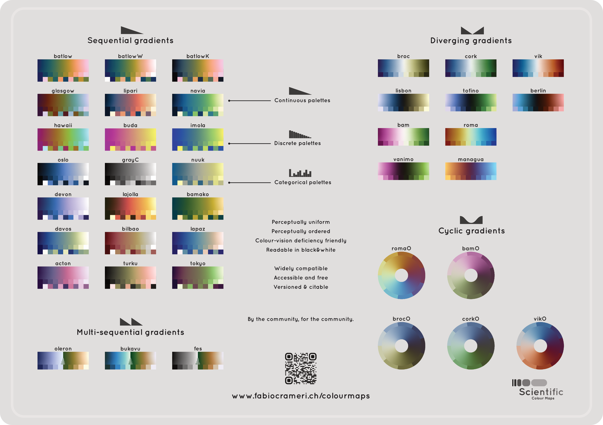

# Scientific Color Maps

A collection of scientifically accurate color maps for use in data visualization.

## Overview

This package provides a set of pre-defined color maps that can be used to visualize data. Each color map is designed to accurately represent the underlying data, taking into account human perception and color theory.

## Features

* 32 scientifically accurate color maps, each with its own unique characteristics and uses.
* Categorized palettes for easy selection and use.
* Support for discrete color sampling (10, 25, 50, and 100 samples).
* Easy to use and integrate into your Swift project.
* Colors are easily convertible to `CGColor`, `NSColor`, `UIColor`, `CIColor`, `SKColor`, `simd_float3`

## Usage

To use the color maps in this package, simply import it into your Swift project and use the global instance of the desired color map. For example:

```swift
import ScientificColorMaps

let colorMap = ScientificColorMaps.batlow
```

## Color Representation - ScientificColor

Each color is stored as platform agnostic `ScientificColor`. Internally the color components are stored as red, green, blue and represented as Float. Each Float is in the range 0 to 1. The raw values can be obtained by accessing the instances' constants: `red`, `green` and `blue`. ScientificColor is Sendable, Equatable and Hashable.

This type provides conversions to `UIColor`, `NSColor`, `CIColor`, `SKColor`, `simd_float3` if the respective type is available. Either by a generic:
```swift
    public func into<T>() -> T
```
Or direct conversions:
* `asTuple() -> (red: Float, green: Float, blue: Float)`
* `asArray() -> [Float]`
* `asCGColor() -> CGColor`
* `asCIColor() -> CIColor`
* `asNSColor() -> NSColor`
* `asUIColor() -> UIColor`
* `asSimd() -> simd_float3`

Every ScientificColor comes with an index value, which is not included in hash or equation test.
It provides the `index: Int` (0-255) of the related color into the respective palette. If the categorized palette is used, then `categoryIndex: Int?` is not nil and gives the color's index of the category (0-99).

## List of Color palettes
Every color palette offers 256 colors
`ScientificColorMaps.palettes() -> [ScientificColorMaps]`

## List of Color palettes with categories
All color palettes, which offer in addition 100 categories
`ScientificColorMaps.categorizedPalettes() -> [ScientificColorMaps]`

## API of ScientificColorMaps
* `name` ... String
* `rgb_data` ... array of 256 `[ScientificColor]`
* `categorical` ... array of 100 `[ScientificColor]` if defined, otherwise nil
* `discrete10() -> [ScientificColor]` ... subset of 10 colors
* `discrete25() -> [ScientificColor]` ... subset of 25 colors
* `discrete50() -> [ScientificColor)]` ... subset of 50 colors
* `discrete100() -> [ScientificColor]` ... subset of 100 colors
* `mapToColor(value: Float, minValue: Float = 0, maxValue: Float = 1) -> ScientificColor`

# Code generator

Just run `swift run CodeGenerator` in the package directory, which will (re-)create the color palette swift files in folder `Sources/ScientificColorMaps/ColorMaps`

# Color Deficiency Simulation

The color deficiency simulation is based on:
[A Physiologically-based Model for Simulation of Color Vision Deficiency](https://www.inf.ufrgs.br/%7Eoliveira/pubs_files/CVD_Simulation/CVD_Simulation.html)

The functionality is only available, if simd can be imported. The enum `ColorDeficiency` will be provided,
which offers the different anomalies: protanomaly, deuteranomaly and tritanomaly with possibility to
adjust the severity from 0 - none to 1 - full.

The enum provides the function `mapRGB(rgb: simd_float3) -> simd_float3` to map the actual rgb value to a simulated rgb value, which is from view under color deficiency.

To illustrate the inner contrast, there are diagrams generated using `swift run GenerateDiagram` and stored in the folder Diagrams. The simulated delta for the colormap `discrete50()` in the folder `range` and first 10 of `categorical` in the folder `categorical`. The resulting images are squares with the colormaps` color along each axis and the color value represents the difference between the colors. The upper left triangle is the difference between the color along x- and y-axis. The two lower right triangles illustrates the contrast to white and black as background color. The difference of the color is the distance between the rgb-values. This cannot be expected to relate to the ability to distinguish between colors, but at least it gives hints in this regard. For example imola appears to be readable well on black and white background.

# Note:

API may change

# Colors



# License

This package is licensed under the MIT License. The color data has its own license. See in the respective file +LICENCE.pdf

## Acknowledgments

* This package was generated using data from Version 8.0.1 of the Scientific Colour Maps, available at <https://www.fabiocrameri.ch/colourmaps/>.
